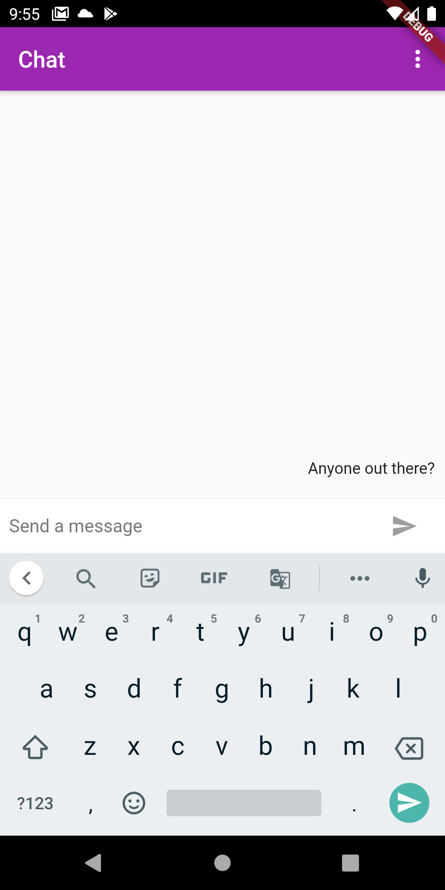
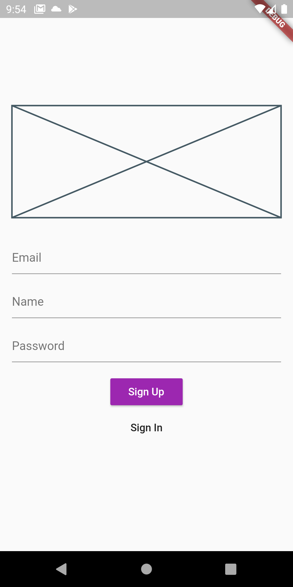

# Chat

Chat app using Flutter and Firebase.

## Screenshots

Chat                          |  SignUp
:----------------------------:|:-----------------------------:
   | 

## Getting Started

A few resources to get you started if this is your first Flutter project:

- [Lab: Write your first Flutter app](https://flutter.dev/docs/get-started/codelab)
- [Cookbook: Useful Flutter samples](https://flutter.dev/docs/cookbook)

For help getting started with Flutter, view our
[online documentation](https://flutter.dev/docs), which offers tutorials,
samples, guidance on mobile development, and a full API reference.

## Prerequisites To Run Project

You will need to add your own Google Services files for iOS and Android:

- [Docs: Google Services Setup](https://firebase.google.com/docs/flutter/setup)
